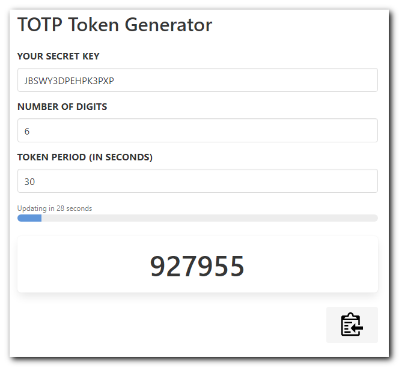

# Generate time-based one time passwords in the browser <!-- omit in toc -->



## Table of Contents <!-- omit in toc -->

- [Introduction](#introduction)
- [Full Demo Link](#full-demo-link)
- [Providing parameters in the URL](#providing-parameters-in-the-url)
  - [Private key](#private-key)
  - [Digits and period](#digits-and-period)
- [Authy support](#authy-support)
  - [Extract Authy secret key from Chrome App](#extract-authy-secret-key-from-chrome-app)
  - [Convert hex keys to base-32](#convert-hex-keys-to-base-32)
  - [Authy settings](#authy-settings)
  - [Import using QR codes](#import-using-qr-codes)
- [Other Resources](#other-resources)

## Introduction

This page lets you easily generate a time-based one time password (TOTP) entirely in the web browser in case you ever lose access to your phone.

It uses the excellent [otpauth](https://github.com/zant95/otpauth) package, downloaded from [raw.githubusercontent.com/zant95/otpauth/master/dist/otpauth.min.js](https://raw.githubusercontent.com/zant95/otpauth/master/dist/otpauth.min.js).

## Full Demo Link

[Full Demo](https://totp.danhersam.com/)

## Providing parameters in the URL

### Private key

You can provide the key in the URL using the URI fragment or a query parameter, for example: `https://totp.danhersam.com/#/KEY` or `https://totp.danhersam.com?key=KEY`

### Digits and period

You can also provide the digits and token period using a query string in the URL, for example: `https://totp.danhersam.com/?period=60&digits=6&key=KEY`

## Authy support

To use Authy tokens outside of the Authy app, you need to extract the secret key and convert it to base-32. The resulting token can then be used with this tool.

### Extract Authy secret key from Chrome App

1. Install the [Authy app](https://chrome.google.com/webstore/detail/authy/gaedmjdfmmahhbjefcbgaolhhanlaolb?hl=en) in Chrome.
1. Enter `chrome://extensions` in the address bar.
1. Check **Developer mode**.
1. Click the `main.html` link in the *Inspect views* section of the Authy app.
1. Navigate to the Console.
1. Paste the code below in the console and hit Enter.

```
appManager.getModel().forEach(model => console.log(`${model.name}: ${model.secretSeed}`));
```

### Convert hex keys to base-32

Convert each exported hex key from above using the [hex to base-32 converter](https://totp.danhersam.com/hex-to-base32.html) in this repository.

### Authy settings

Use the following settings for native Authy tokens.

**Digits:** 7
**Period:** 10

The period shown in the Authy Chrome App is 20 seconds, but it actually uses 10 second intervals and skips every other token.

If your authenticator application only allows 6 or 8 digits (like [FreeOTP](https://freeotp.github.io/)), choose 8 digits and use the last 7 digits for your code.

### Import using QR codes

To make it easier to import Authy entries into another authenticator app, generate QR codes using my [QR code generator](https://dan.hersam.com/tools/gen-qr-code.html).

## Other Resources

* https://www.pommepause.com/2014/10/how-to-extract-your-totp-secrets-from-authy/
* https://github.com/winauth/winauth/issues/545
* https://randomoracle.wordpress.com/2017/02/15/extracting-otp-seeds-from-authy/
* https://gist.github.com/tresni/83b9181588c7393f6853
* https://gist.github.com/Ingramz/14a9c39f8c306a2d43b4